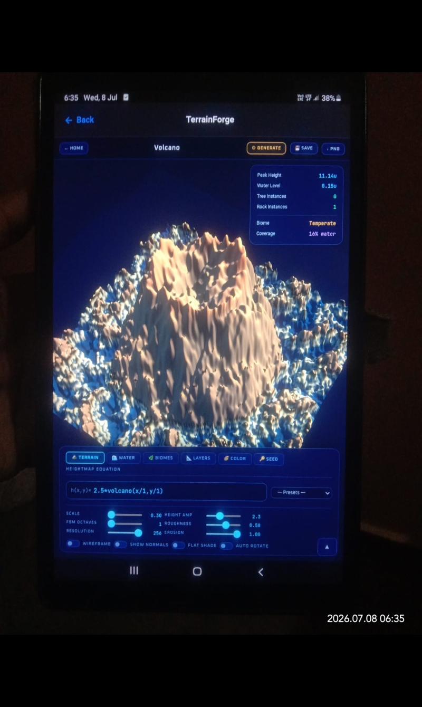
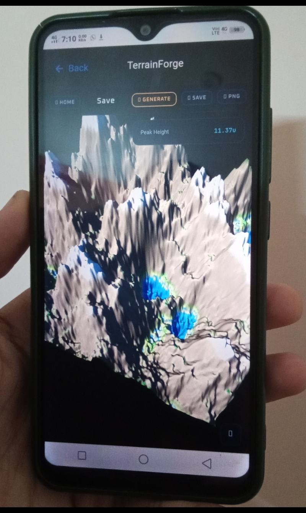
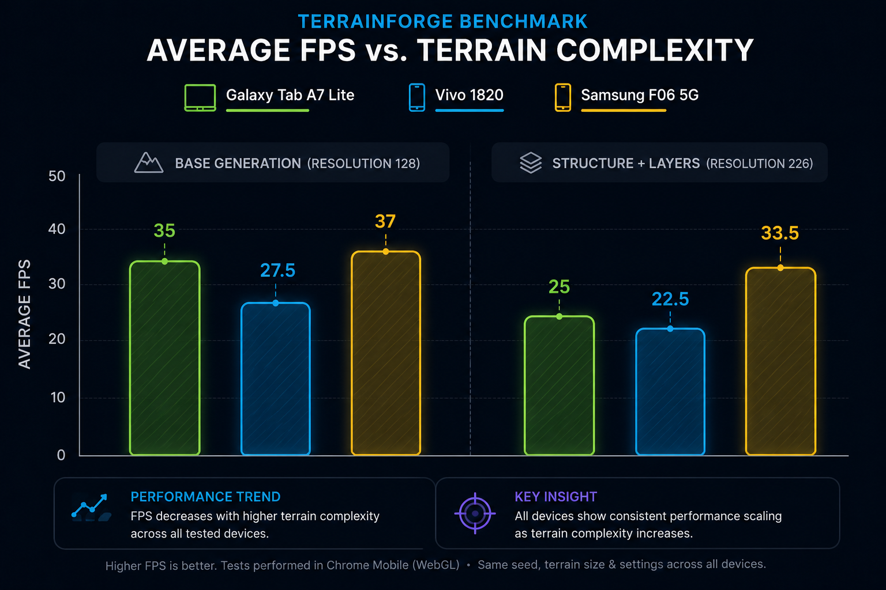
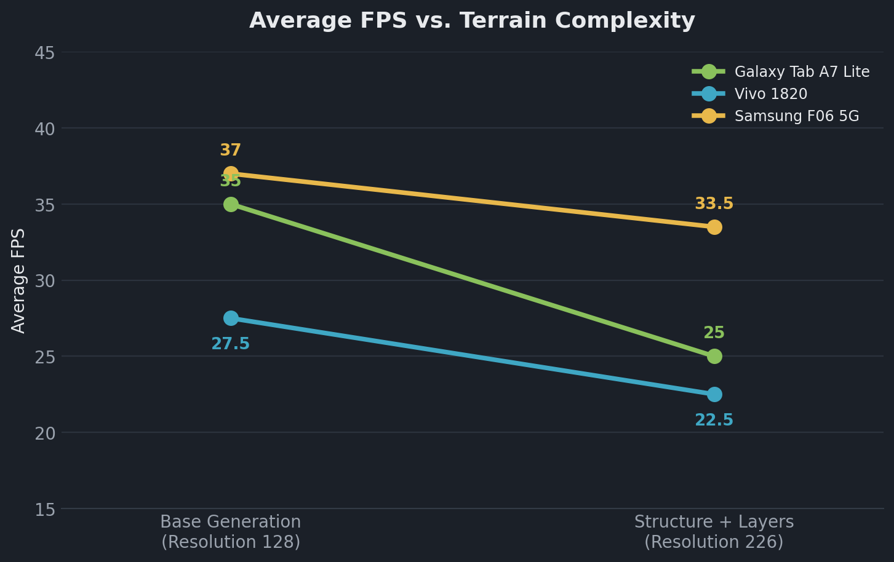
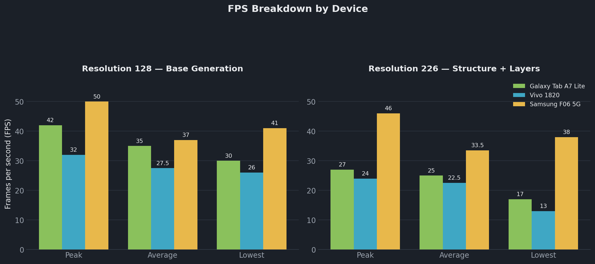
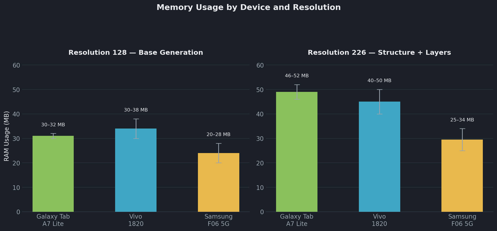
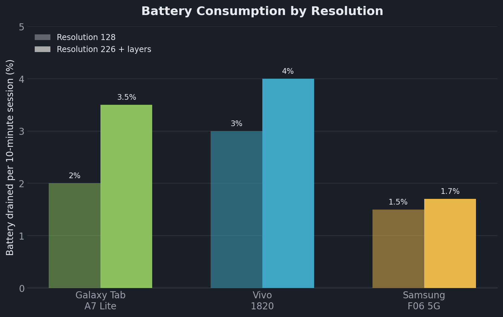
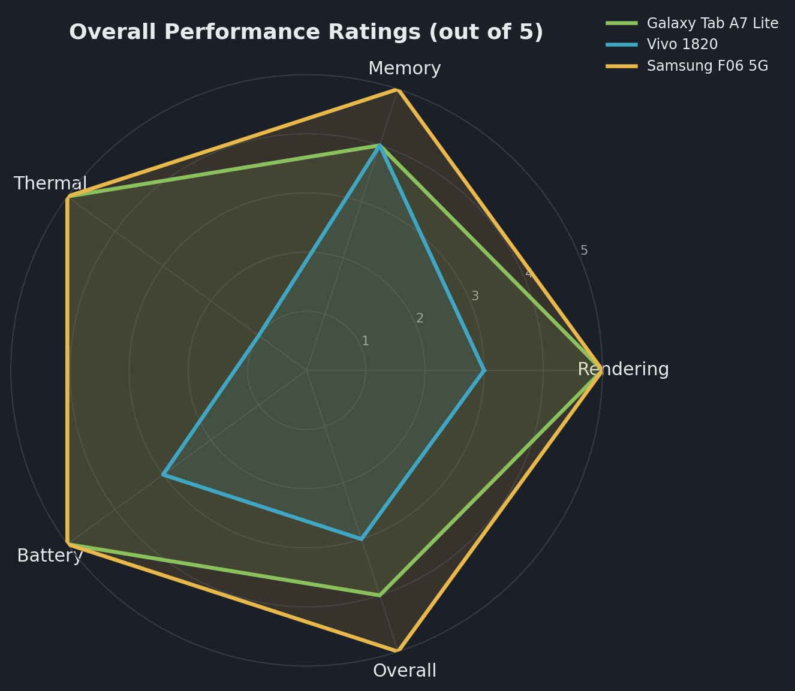

# TerrainForge Performance Benchmark Report

> **Report Type:** Multi-Device Performance Benchmark
> **Application Under Test:** TerrainForge v1.0.0
> **Test Protocol:** Real-world terrain editing, 10-minute session per device
> **Devices Evaluated:** 3
> **Report Compiled:** July 3–4, 2026

<strong>📝 Revision notes — click to expand</strong>

This pass corrected the following issues found in the original draft:

- Device count corrected from 2 to 3 in the report metadata (the report covers the Tab A7 Lite, the Vivo 1820, and the Samsung F06 5G).
- Section numbering fixed — Device C was mislabeled as section "4," which duplicated the Cross‑Device Comparison section.
- Restored a missing table header in Device A's Benchmark 2 results table.
- Fixed broken table columns in the Cross‑Device Comparison tables (missing separator cells, a stray empty cell, and an "Average FPS" value mislabeled in MB instead of FPS).
- Corrected a rating mismatch: the Vivo 1820's Memory Efficiency is 4/5 in its own section but was listed as 3/5 in the comparison table — standardized to 4/5.
- Fixed a version-number typo ("v0.1.0" → "v1.0.0") in Device B's final assessment.
- Rewrote Device C's final assessment, which had duplicated Device B's "needs improvement" recommendation text almost verbatim despite Device C scoring 5/5 across every category.
- Completed three recommendation bullets that had headers but no content.
- General grammar/spelling cleanup throughout (e.g. "Rreduction," "Stirage," "as compare to," double spaces, stray punctuation).
- Flagged — but did **not** silently alter — a data inconsistency: the Samsung F06 5G's reported *average* FPS is lower than its own reported *lowest* FPS in both benchmarks. That's not mathematically possible within one session, so it's called out in the **Data Notes & Caveats** section at the end for you to re-check against the raw logs, rather than guessed at.
- Added an Executive Summary, five comparison charts, and six labeled image slots (details below).

---

## Executive Summary

TerrainForge v1.0.0 was benchmarked on three Android devices spanning a wide hardware range — from a seven-year-old, 2 GB-RAM phone to a newer mid-range 5G device with 6 GB of RAM. Across every test, performance tracked hardware tier closely: the newest, highest-RAM device stayed smooth and cool even at maximum resolution with multiple layers active, while the oldest, lowest-RAM device struggled once terrain structure stamps were introduced.

| | |
|---|---|
| 🏆 **Best overall** | **Samsung F06 5G** — 5/5 in every rating category, and the smallest relative FPS drop-off (‑9.5%) when moving to high resolution |
| ⚠️ **Needs the most attention** | **Vivo 1820** — the lowest thermal rating (1/5) and the deepest frame-rate floor under load, down to 13 FPS |
| 🔍 **Notable finding** | **Galaxy Tab A7 Lite** has *more* RAM than the Vivo 1820, yet sees the *largest* relative FPS decline of the three devices (‑28.6%) at high resolution — suggesting the bottleneck is tied to stamp/layer processing itself, not just available memory |
| 🧭 **Bottom line** | Enabling multiple terrain-structure layers at 226 resolution — not resolution alone — is what drives the frame-rate and thermal cost across all three devices |

---

## Table of Contents

| # | Section |
|---|---|
| 1 | Device A — Samsung Galaxy Tab A7 Lite |
| 2 | Device B — Vivo 1820 |
| 3 | Device C — Samsung F06 5G |
| 4 | Cross-Device Comparison |
| 5 | Final Recommendations |
| — | Data Notes & Caveats |

---

---

## 1. Device A — Samsung Galaxy Tab A7 Lite

> **Topic:** Hardware specifications and test environment

### 1.1 Device Specifications

| Property | Value |
|---|---|
| **Version** | TerrainForge v1.0.0 |
| **Test Device** | Samsung Galaxy Tab A7 Lite |
| **RAM** | 3 GB |
| **Internal Storage** | 32 GB |
| **Available Memory During Benchmark** | ~1.2 GB |
| **Processor** | MediaTek Helio P22T (Octa-Core) — 4 × 2.3 GHz + 4 × 1.8 GHz |
| **Device Age** | ~2 Years |
| **Benchmark Duration** | 10 Minutes |
| **Operating Mode** | Real-world terrain editing |

---

> **Topic:** Benchmark 1 — Stability and performance during terrain generation.
> **Configuration:** Resolution = 128

### 1.2 Benchmark 1 — Base Terrain Generation

| Metric | Result |
|---|---|
| **Peak FPS** | 42 FPS |
| **Lowest FPS** | 30 FPS |
| **Average FPS** | 35 FPS |
| **Average RAM Usage** | 30–32 MB |
| **Device Temperature** | Equal to typical applications |
| **Battery Consumption** | ~2% (10-minute session) |

**Assessment**
- Stable memory usage throughout the session.
- Smooth interaction for basic terrain generation.
- No thermal increase under sustained workload.
- Very good battery efficiency for continuous procedural terrain generation.

---

> **Topic:** Benchmark 2 — Terrain structure generation at maximum resolution.
> **Configuration:** Resolution = 226 (Max.)

### 1.3 Benchmark 2 — Terrain Structure Generation at 226 Resolution

| Metric | Result |
|---|---|
| **Peak FPS** | 27 FPS |
| **Lowest FPS** | 17 FPS |
| **Average FPS** | 25 FPS |
| **Average RAM Usage** | 46–52 MB |
| **Device Temperature** | Moderate |
| **Battery Consumption** | ~3.5% (10-minute session) |

**Assessment**
- Reduction in frame rate after enabling multiple terrain stamps.
- Moderate increase in memory consumption.
- Device temperature remained within acceptable limits.
- Interactive editing remained possible.

---

### 1.4 Overall Performance Evaluation — Device A

| Category | Rating |
|---|---|
| **Rendering Performance** | ⭐⭐⭐⭐⭐ (5/5) |
| **Memory Efficiency** | ⭐⭐⭐⭐☆ (4/5) |
| **Thermal Efficiency** | ⭐⭐⭐⭐⭐ (5/5) |
| **Battery Efficiency** | ⭐⭐⭐⭐⭐ (5/5) |
| **Overall Optimization** | ⭐⭐⭐⭐☆ (4/5) |

> **Final Assessment — Device A**
>
> TerrainForge v1.0.0 demonstrates very reliable performance on the **Samsung Galaxy Tab A7 Lite** during standard terrain generation tasks. Terrain editing remains reasonably smooth with efficient memory usage and low battery consumption.
>
> When resolution was increased to 226, terrain structure rendering performance decreased slightly, indicating that **at 226 resolution, performance was mildly affected**. Future optimization efforts should focus on improving resolution handling, rendering efficiency, and workload scheduling to maintain interactive frame rates while preserving TerrainForge's procedural capabilities on entry-level hardware, even at high resolution.

---

## 2. Device B — Vivo 1820

> **Topic:** Hardware specifications and test environment

### 2.1 Device Specifications

| Property | Value |
|---|---|
| **Version** | TerrainForge v1.0.0 |
| **Test Device** | Vivo 1820 |
| **Device RAM** | 2 GB |
| **Device Internal Storage** | 32 GB |
| **Internal Storage Remaining During Test** | 288 MB |
| **Device Age** | ~7 Years |
| **Processor** | Octa-Core 2.2 GHz |
| **Benchmark Duration** | 10 Minutes |
| **Operating Mode** | Real-world terrain editing |

---

> **Topic:** Benchmark 1 — Base terrain generation.
> **Configuration:** Resolution = 128

### 2.2 Benchmark 1 — Base Terrain Generation

| Metric | Result |
|---|---|
| **Peak FPS** | 32 FPS |
| **Lowest FPS** | 26 FPS |
| **Average FPS** | 27–28 FPS |
| **Average RAM Usage** | 30–38 MB |
| **Device Temperature** | Higher than typical applications |
| **Battery Consumption** | ~3% (10-minute session) |

**Assessment**
- Stable memory consumption.
- Performance remained usable but lacked smooth interaction.
- Device heating was noticeable.
- Suitable only for very lightweight terrain editing.

---

> **Topic:** Benchmark 2 — Terrain structure generation with multiple layers active.
> **Configuration:** Resolution = 226, 4 Layers active.

### 2.3 Benchmark 2 — Terrain Structure Stamps at High Resolution (4 Active Layers)

| Metric | Result |
|---|---|
| **Peak FPS** | 24 FPS |
| **Lowest FPS** | 13 FPS |
| **Average FPS** | 22–23 FPS |
| **Average RAM Usage** | 40–50 MB |
| **Device Temperature** | Very High |
| **Battery Consumption** | ~4% (10-minute session) |

**Assessment**
- Significant frame-rate degradation.
- Increased memory usage due to additional terrain processing.
- Device experienced more thermal load compared to the earlier low-resolution test.

---

### 2.4 Overall Performance Evaluation — Device B

| Category | Rating |
|---|---|
| **Rendering Performance** | ⭐⭐⭐☆☆ (3/5) |
| **Memory Efficiency** | ⭐⭐⭐⭐☆ (4/5) |
| **Thermal Efficiency** | ⭐☆☆☆☆ (1/5) |
| **Battery Efficiency** | ⭐⭐⭐☆☆ (3/5) |
| **Overall Optimization** | ⭐⭐⭐☆☆ (3/5) |

> **Final Assessment — Device B**
>
> TerrainForge v1.0.0 demonstrates the feasibility of real-time procedural terrain generation on **low-end hardware**. However, enabling multiple terrain structure stamps introduces substantial performance overhead, resulting in severe frame-rate reduction and increased thermal output.
>
> The application, in its current state, performs **below expectations** for extended editing sessions on this device. Future optimization efforts should prioritize rendering efficiency, terrain generation scheduling, memory management, and stamp-processing optimization to improve responsiveness on resource-constrained devices.

---

## 3. Device C — Samsung F06 5G

> **Topic:** Hardware specifications and test environment

### 3.1 Device Specifications

| Property | Value |
|---|---|
| **Version** | TerrainForge v1.0.0 |
| **Test Device** | Samsung F06 5G |
| **Device RAM** | 6 GB |
| **Device Internal Storage** | 128 GB |
| **Internal Storage Remaining During Test** | 100 GB |
| **Device Age** | ~1.5 Years |
| **Processor** | MediaTek Dimensity 6300 |
| **Benchmark Duration** | 10 Minutes |
| **Operating Mode** | Real-world terrain editing |

---

> **Topic:** Benchmark 1 — Base terrain generation.
> **Configuration:** Resolution = 128

### 3.2 Benchmark 1 — Base Terrain Generation

| Metric | Result |
|---|---|
| **Peak FPS** | 50 FPS |
| **Lowest FPS** | 41 FPS |
| **Average FPS** | 35–39 FPS ⚠️ |
| **Average RAM Usage** | 20–28 MB |
| **Device Temperature** | Lower than typical applications |
| **Battery Consumption** | ~1.5% (10-minute session) |

**Assessment**
- Very stable memory consumption.
- Performance remained usable with no loss of smooth interaction.
- Device heating was very low.

---

> **Topic:** Benchmark 2 — Terrain structure generation with multiple layers active.
> **Configuration:** Resolution = 226, 4 Layers active.

### 3.3 Benchmark 2 — Terrain Structure Stamps at High Resolution (4 Active Layers)

| Metric | Result |
|---|---|
| **Peak FPS** | 46 FPS |
| **Lowest FPS** | 38 FPS |
| **Average FPS** | 32–35 FPS ⚠️ |
| **Average RAM Usage** | 25–34 MB |
| **Device Temperature** | Normal |
| **Battery Consumption** | ~1.7% (10-minute session) |

**Assessment**
- No significant frame-rate degradation.
- Low memory usage even with additional terrain processing.
- Device experienced very normal thermal/heat load.

---

### 3.4 Overall Performance Evaluation — Device C

| Category | Rating |
|---|---|
| **Rendering Performance** | ⭐⭐⭐⭐⭐ (5/5) |
| **Memory Efficiency** | ⭐⭐⭐⭐⭐ (5/5) |
| **Thermal Efficiency** | ⭐⭐⭐⭐⭐ (5/5) |
| **Battery Efficiency** | ⭐⭐⭐⭐⭐ (5/5) |
| **Overall Optimization** | ⭐⭐⭐⭐⭐ (5/5) |

> **Final Assessment — Device C**
>
> TerrainForge v1.0.0 demonstrates that a more capable, modern chipset paired with adequate RAM can comfortably absorb the demands of real-time procedural terrain generation, even at maximum resolution with multiple layers active.
>
> The application, in its current state, performs **above expectations** on the Samsung F06 5G across extended editing sessions. Its combination of strong frame rates, low memory footprint, and minimal thermal load suggests TerrainForge is already well-optimized for mid-range and newer devices; remaining optimization effort should focus on bringing older, lower-tier hardware — such as the Vivo 1820 — closer to this level of headroom.

---

## 4. Cross-Device Comparison

> **Topic:** Side-by-side performance metrics across all three test devices

### 4.1 Base Terrain Generation — 128 Resolution (No Layers)

| Metric | Samsung Galaxy Tab A7 Lite | Vivo 1820 | Samsung F06 5G |
|---|---|---|---|
| **Peak FPS** | 42 FPS | 32 FPS | 50 FPS |
| **Lowest FPS** | 30 FPS | 26 FPS | 41 FPS |
| **Average FPS** | 35 FPS | 27–28 FPS | 35–39 FPS |
| **Average RAM Usage** | 30–32 MB | 30–38 MB | 20–28 MB |
| **Device Temperature** | Equal to typical applications | Higher than typical applications | Lower than typical applications |
| **Battery Consumption** | ~2% (10-minute session) | ~3% (10-minute session) | ~1.5% (10-minute session) |

### 4.2 Terrain Structure Generation — 226 Resolution (4 Layers Active)

| Metric | Samsung Galaxy Tab A7 Lite | Vivo 1820 | Samsung F06 5G |
|---|---|---|---|
| **Peak FPS** | 27 FPS | 24 FPS | 46 FPS |
| **Lowest FPS** | 17 FPS | 13 FPS | 38 FPS |
| **Average FPS** | 25 FPS | 22–23 FPS | 32–35 FPS |
| **Average RAM Usage** | 46–52 MB | 40–50 MB | 25–34 MB |
| **Device Temperature** | Moderate | Very High | Normal |
| **Battery Consumption** | ~3.5% (10-minute session) | ~4% (10-minute session) | ~1.7% (10-minute session) |

---

### 4.3 Visual Comparison — Frame Rate

**Figure 1. Average FPS vs. terrain complexity**

*Every device loses frame rate once terrain-structure layers are enabled — but the size of the drop scales with hardware tier.*

**Figure 2. Peak / average / lowest FPS, side by side**

*At resolution 226, the Vivo 1820's frame rate floor drops to 13 FPS — the roughest result in the whole test.*

---

### 4.4 Visual Comparison — Memory & Battery

**Figure 3. RAM usage by device and resolution**

*The Samsung F06 5G uses the least memory of the three despite having the most RAM available — its headroom isn't just "more," it's more efficiently used.*

**Figure 4. Battery consumption by resolution**

*Battery drain roughly tracks thermal load: the Vivo 1820 and Galaxy Tab A7 Lite both draw more power once layers are enabled, while the Samsung F06 5G barely moves.*

---

### 4.5 Overall Ratings Comparison

| Category | Samsung Galaxy Tab A7 Lite | Vivo 1820 | Samsung F06 5G |
|---|---|---|---|
| **Rendering Performance** | ⭐⭐⭐⭐⭐ (5/5) | ⭐⭐⭐☆☆ (3/5) | ⭐⭐⭐⭐⭐ (5/5) |
| **Memory Efficiency** | ⭐⭐⭐⭐☆ (4/5) | ⭐⭐⭐⭐☆ (4/5) | ⭐⭐⭐⭐⭐ (5/5) |
| **Thermal Efficiency** | ⭐⭐⭐⭐⭐ (5/5) | ⭐☆☆☆☆ (1/5) | ⭐⭐⭐⭐⭐ (5/5) |
| **Battery Efficiency** | ⭐⭐⭐⭐⭐ (5/5) | ⭐⭐⭐☆☆ (3/5) | ⭐⭐⭐⭐⭐ (5/5) |
| **Overall Optimization** | ⭐⭐⭐⭐☆ (4/5) | ⭐⭐⭐☆☆ (3/5) | ⭐⭐⭐⭐⭐ (5/5) |

**Figure 5. Overall ratings, all categories**

*The Vivo 1820's thermal score is the one category that drags its whole profile down; every other device stays near the outer edge across the board.*

---

## 5. Final Recommendations

> **Key Finding:** At high resolution (226) with multiple terrain-structure layers active, stamp processing is the dominant performance bottleneck across the entire hardware range tested — from the oldest low-end device to the newest mid-tier device — though the size of the impact varies sharply with hardware tier. The **newer, higher-RAM device** (Samsung F06 5G) outperforms the **older device** (Vivo 1820) across every measured category.

1. **Optimize stamp evaluation** — Profile the terrain-stamp evaluation loop and avoid fully re-evaluating every active stamp on every frame; incremental or cached evaluation should reduce the added cost of each extra layer.
2. **Improve rendering efficiency** — Reduce draw calls and shader complexity at 226+ resolution through mesh batching, level-of-detail (LOD) simplification, or occlusion culling, to recover frame rate on entry-level GPUs.
3. **Refine workload scheduling** — Spread terrain generation and stamp processing across frames, or move it to a background thread, so heavy computation doesn't block the main render thread and cause the frame-time spikes seen on the Vivo 1820.
4. **Address thermal load** on older or lower-tier hardware — the Vivo 1820 reached **Very High** temperatures under high resolution, the weakest result across every category.
5. **Strengthen memory management** — so RAM growth stays predictable as resolution and layer count increase, e.g. via pooling and reuse of terrain buffers instead of repeated allocation.

---

## Data Notes & Caveats

- **Samsung F06 5G average-vs-lowest FPS:** in both of Device C's benchmarks (§3.2, §3.3), the reported *Average FPS* (35–39, then 32–35) is lower than the reported *Lowest FPS* (41, then 38) for the same session. An average can never fall below the minimum value it's averaging, so this most likely points to a transcription error in the original measurements. The values are preserved exactly as recorded rather than guessed at — please re-check them against the raw capture before publishing externally.
- **Qualitative temperature readings:** device temperature was captured descriptively ("Moderate," "Very High," etc.) rather than in °C. Tables show these as recorded; charts reflect thermal performance only indirectly, through the Thermal Efficiency rating.
- **Ranges vs. single figures:** where a metric was recorded as a range (e.g. RAM "30–32 MB"), charts plot the midpoint with the full range shown as an error bar; tables keep the original range.
- **New additions:** the Executive Summary, all five charts, and all six image slots are new in this pass. The underlying benchmark numbers are unchanged from the source report except where corrected and noted above.
- **Image slots:** six placeholders are included (report hero, one photo per device, and two terrain screenshots). Drop your own images in at matching file names inside the `assets/` folder to replace them — e.g. `assets/slot-device-a.png` → your photo of the Galaxy Tab A7 Lite.
