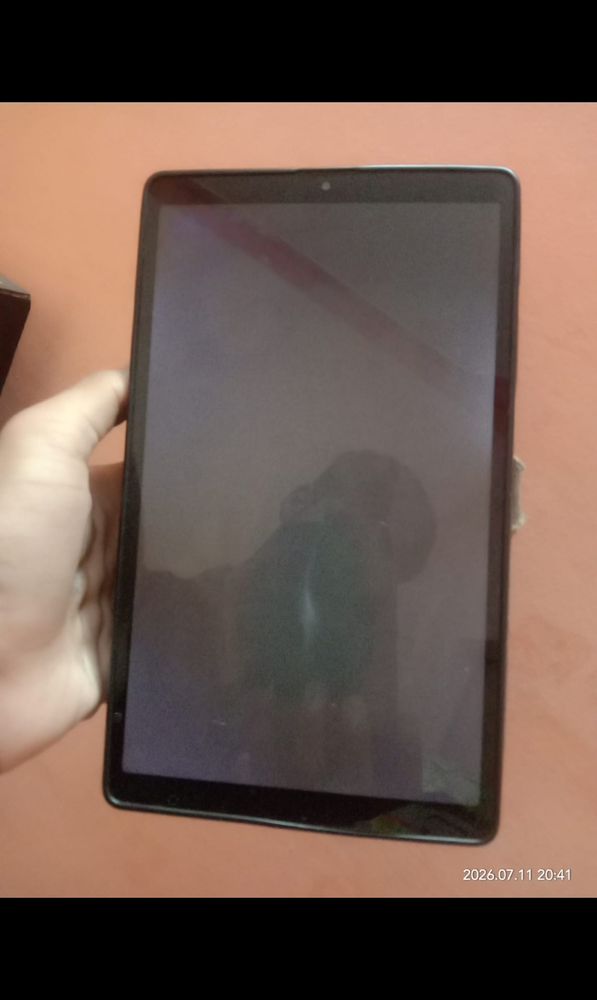

### High Resolution Crash

**Date: July 2026**

**Background**

_Some users requested support for terrain resolutions higher than the existing maximum of 226×226. To evaluate the feasibility, I temporarily increased the maximum terrain resolution to 396×396._

### Test Device
| Specification | Value |
|--------------|-------|
| **Device** | Samsung Galaxy Tab A7 Lite |
| **RAM** | 3 GB |
| **Platform** | Android |
| **Browser** | Chromium-based mobile browser |
### Result

**The experiment was unsuccessful.**

When generating terrain at a resolution of 396×396, the device became unresponsive during mesh generation. The browser stopped responding, the display turned black, and the tablet remained frozen for approximately 20 minutes before recovering.

The device also became unusually hot during the test, indicating that the workload exceeded the hardware's practical limits.

---

Black Screen After Crash

Figure 1 — The tablet became completely unresponsive after attempting to generate a high-resolution terrain.

---

---

### Root Cause

The increased terrain resolution dramatically increased:

- Vertex count
- Triangle count
- Memory allocation
- GPU workload
- CPU mesh generation time

**On low-memory hardware, these combined requirements exceeded the available system resources.**

### Decision

TerrainForge continues to use 226×226 as its maximum supported resolution for mobile devices.

This limit was selected after balancing:

- Performance
- Stability
- Device compatibility
- Battery consumption

Rather than maximizing resolution, TerrainForge prioritizes a stable experience across entry-level Android devices.

### Lesson Learned

Pushing hardware beyond its practical limits does not improve usability.

**A lower but stable resolution provides a significantly better user experience than a higher resolution that risks freezing or crashing the device.**
